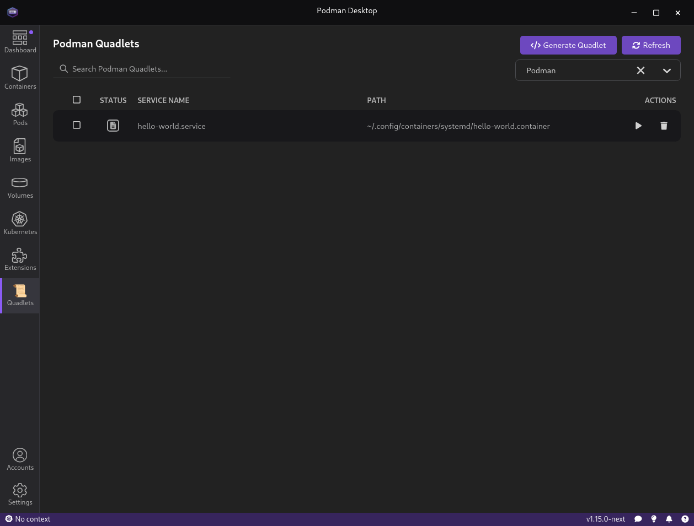
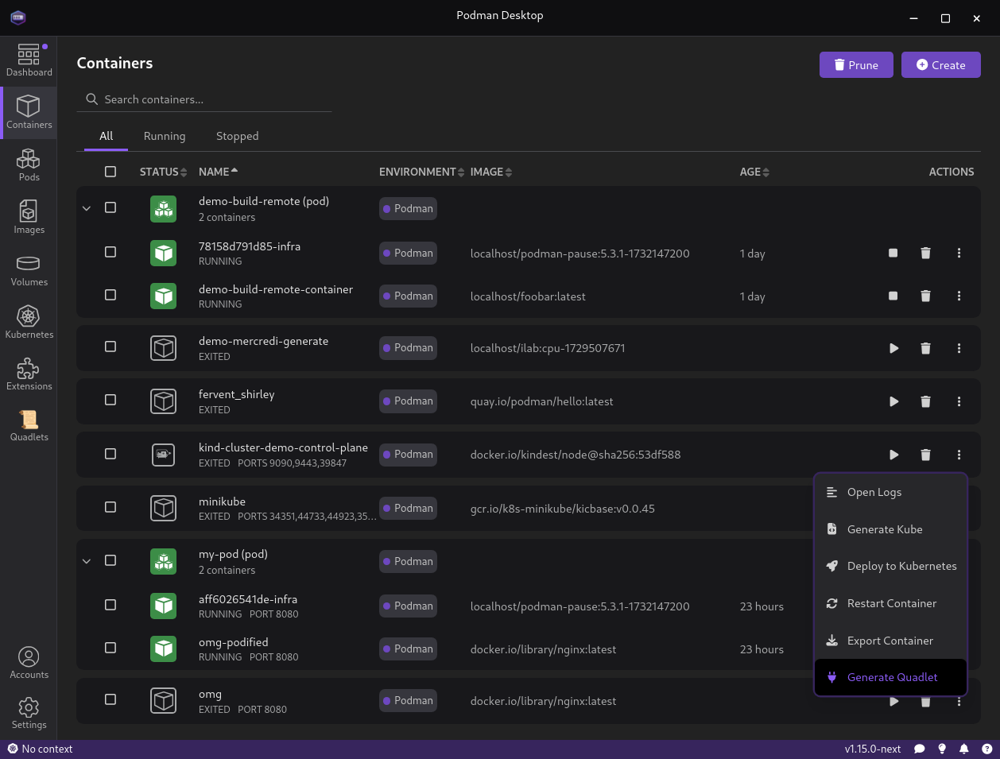
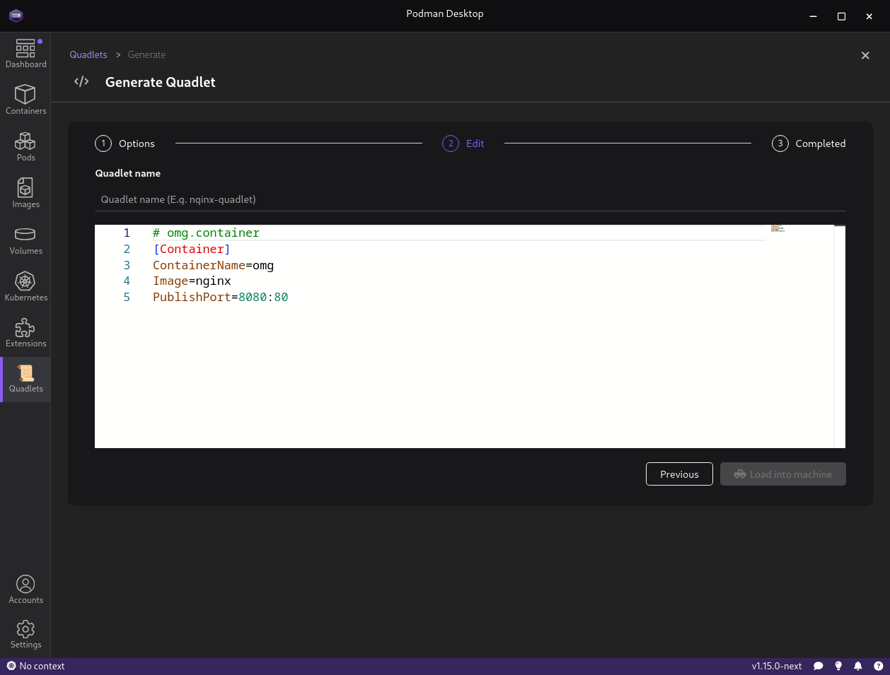
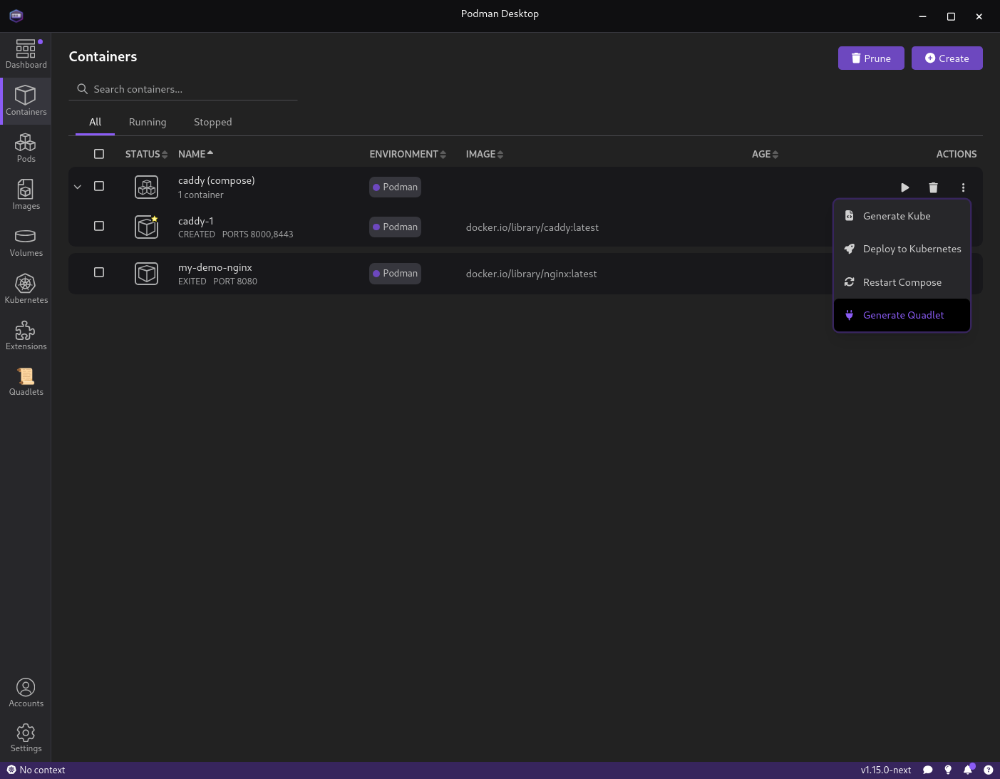
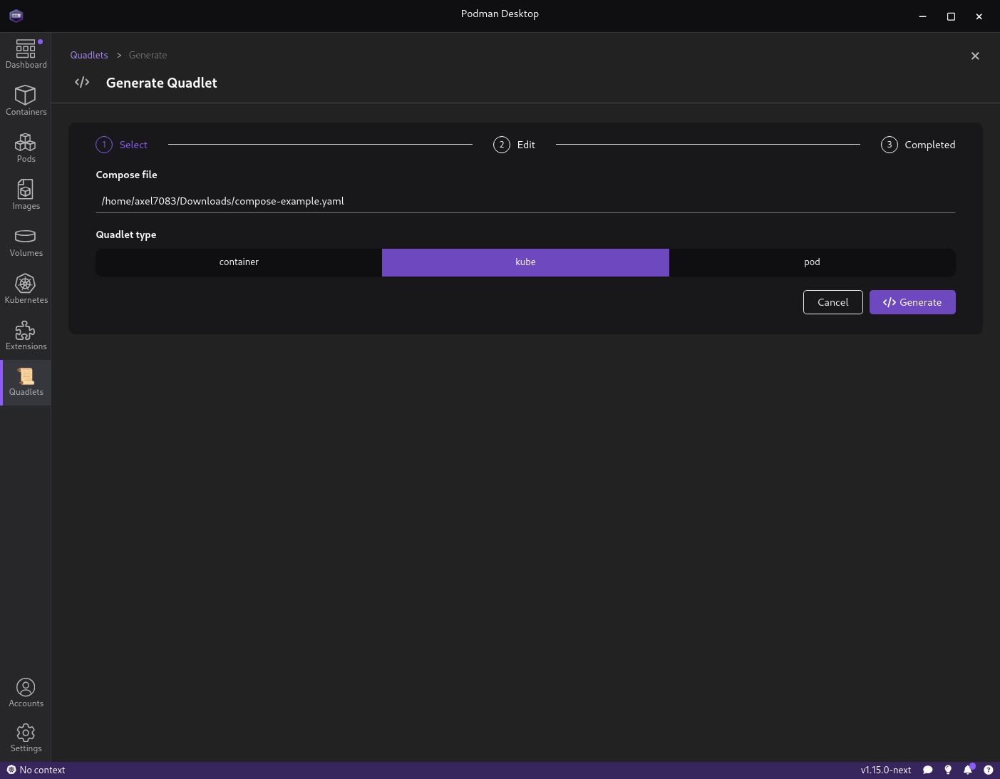

# Podman Desktop Quadlet Extension

## Overview

## Generating Quadlets

This extension will allow you to list, generate, enable and delete podman quadlet in a given Podman Machine.

This extension integrate the [Podlet](https://github.com/containers/podlet) tool, allowing you to generate Quadlet file from 
an existing resource such as a Container or an Image.

### Containers

You can generate Quadlet from the Podman Desktop containers page, as visible bellow

Once generated, the podlet output can be edited before being loaded into the Podman Machine

### Compose

Podlet has a support for create quadlet from an existing compose specification

> Podman Desktop group containers in the same compose project. 
> This allows us to determine which spec has been used by looking at the `com.docker.compose.project.config_files` containers label

Two type of Quadlet can be generated from a compose specification, `Container`, `Kube` or `Pod`

